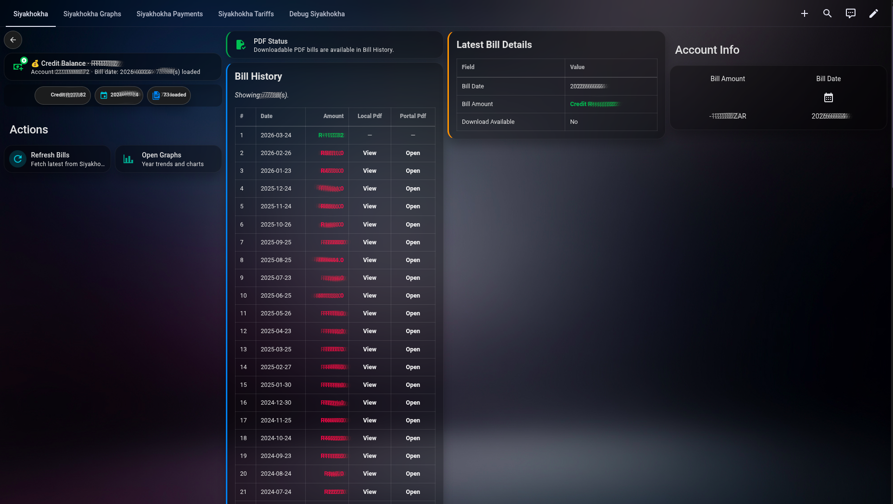
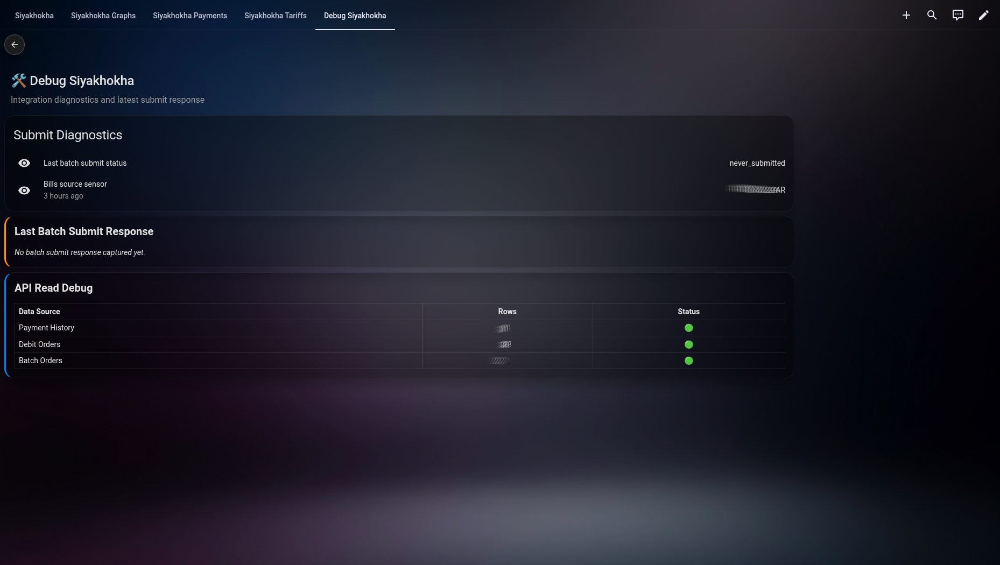
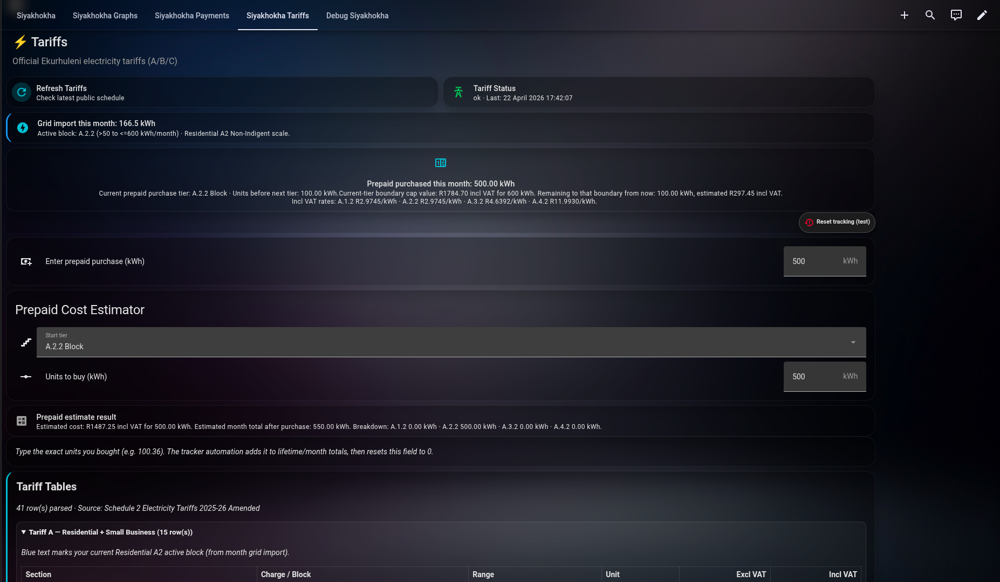

# Siyakhokha Bridge (Home Assistant custom integration)

<p align="center">
  
</p>

<p align="center">
  
</p>

## Dashboard Preview

Visual preview from the included dashboard examples:





For the complete screenshot walkthrough and replication docs, see `../../examples/README.md`.

This integration logs in to Siyakhokha, fetches the bills API, and exposes bill data as sensors.

It also fetches payment/debit/batch-order APIs and supports once-off batch payment submit via Home Assistant service.

## Files to copy into Home Assistant

Copy this folder into your HA config directory:

- `custom_components/siyakhokha_bridge`

Example destination:

- `/config/custom_components/siyakhokha_bridge`

## Add integration

1. Restart Home Assistant.
2. Go to **Settings -> Devices & Services -> Add Integration**.
3. Search for **Siyakhokha Bridge**.
4. Enter:
   - Username
   - Password
   - Municipal account number
   - Base URL (default already set)
   - Refresh interval (minutes)

Refresh interval supports short testing windows and long production windows:

- Minimum: `1440` minutes (1 day)
- Maximum: `44640` minutes (31 days)

Examples:

- Daily polling: `1440`
- Weekly polling: `10080`
- Monthly polling: `43200` (30 days) or `44640` (31 days)

You can change the interval later without deleting the integration:

- `Settings -> Devices & Services -> Siyakhokha Bridge -> Configure`

## Entities created

- `sensor.latest_bill_amount`
- `sensor.latest_bill_date`
- `sensor.latest_bill_pdf_url`
- `sensor.last_batch_submit_status`
- `button.refresh_bills`
- `button.open_latest_downloadable_bill`

`sensor.latest_bill_amount` attributes include:

- `bills`
- `payment_history`
- `debit_orders`
- `batch_orders`
- `last_batch_submit_response`

## PDF viewing and download URL

The integration now exposes Home Assistant-authenticated PDF URLs for each downloadable bill.

For each bill row attribute:

- `DownloadAvailable`: `true/false`
- `PortalPdfUrl`: direct Siyakhokha portal URL
- `HaPdfUrl`: Home Assistant proxied URL (recommended)

Example proxied URL format:

- `/api/siyakhokha_bridge/<entry_id>/<IdentificationNumber>.pdf`

`latest_downloadable_pdf_url` is also exposed in sensor attributes for quick access.

`latest_downloadable_portal_pdf_url` is exposed for direct portal links.

`last_batch_submit_response` is exposed in sensor attributes for payment submit diagnostics.

`batch_orders` is exposed in sensor attributes and loaded from:

- `/DebitOrder/LoadBatchOrders?q=<token>`

Use this to verify submitted once-off batch payments and their latest statuses.

PDF files are also cached locally under Home Assistant `www/siyakhokha_bridge/<entry_id>/`.
Each bill row includes:

- `LocalPdfPath`
- `LocalPdfUrl` (for example `/local/siyakhokha_bridge/<entry_id>/2026-02-26.pdf`)

Remote links are still exposed in parallel:

- `PortalPdfUrl`
- `HaPdfUrl`

`latest_downloadable_local_pdf_url` is exposed in sensor attributes for the newest local copy.

`button.open_latest_downloadable_bill` creates a persistent notification with a clickable PDF link.

## Dashboard example

A complete example dashboard is available in the repository root:

- `examples/siyakhokha-dashboard.yaml`
- Full dashboard + prepaid replication guide: `examples/README.md`

This is an optional reference you can adapt to your own Lovelace setup.

### Dashboard dependencies

The example dashboard requires these custom cards/resources:

- [Mushroom Cards](https://github.com/piitaya/lovelace-mushroom)
  - `custom:mushroom-chips-card`
  - `custom:mushroom-template-card`
  - `custom:mushroom-title-card`
- [card-mod](https://github.com/thomasloven/lovelace-card-mod)
  - used for custom style blocks (`card_mod`)

Install them via HACS Frontend before importing the example dashboard.

## Service

Manual refresh service:

- `siyakhokha_bridge.refresh`

Optional service data:

- `entry_id`: refresh only one config entry

Once-off batch payment service:

- `siyakhokha_bridge.submit_batch_payment`

Required fields:

- `entry_id`
- `account_numbers` (list)
- `amounts` (list, same order as account_numbers)
- `confirm` (must be `true`)

Single debit-order service:

- `siyakhokha_bridge.submit_single_debit_order`

Required fields:

- `entry_id`
- `bank_account_id`
- `account_id`
- `amount`
- `strike_day`
- `start_date` (`YYYY/MM/DD`)
- `confirm` (must be `true`)

Optional fields:

- `is_recurring` (default `false`)
- `dry_run` (default `true`)

Safety note:

- Keep `dry_run: true` while testing. Set `dry_run: false` only when you intend to submit.

Important:

- Always use UI/service-call confirmation before executing payments.
- Once submitted to Siyakhokha, payments may not be reversible.

## Options (post-setup)

You can change polling interval after installation:

- `Settings -> Devices & Services -> Siyakhokha Bridge -> Configure`

This updates `scan_interval_minutes` without deleting/re-adding the integration.

## Simple bills grid in Lovelace

Use a markdown card and render bill list from sensor attributes:

```yaml
type: markdown
title: Siyakhokha Bills
content: >
  
  | Bill Date | Amount (R) | Ref |
  |---|---:|---|
  
  | {{ b.BillDate }} | {{ '%.2f'|format(b.BillAmount|float) }} | {{ b.IdentificationNumber }} |
  
```

Including a PDF link column:

```yaml
type: markdown
title: Siyakhokha Bills (with PDF)
content: >
  
  | Bill Date | Amount (R) | PDF |
  |---|---:|---|
  
  | {{ b.BillDate }} | {{ '%.2f'|format(b.BillAmount|float) }} |
[Open PDF]({{ b.HaPdfUrl }})Not available |
  
```

## Credits

Special thanks to **Heinz Meulke** ([tomatensaus](https://github.com/tomatensaus)):

- [DeyeSolarDesktop](https://github.com/tomatensaus/DeyeSolarDesktop)
- [Prepaid_electricity_meter.md](https://github.com/tomatensaus/DeyeSolarDesktop/blob/main/Prepaid_electricity_meter.md)

The prepaid meter/tracker flow documented in this repository was inspired by that work.

## Disclaimer

This integration is a hobby project and is provided as-is.

Use the official City of Ekurhuleni portal for official account management and authoritative data:

- https://siyakhokha.ekurhuleni.gov.za/

Use this integration and the included examples at your own discretion and risk,
especially for payment/debit submission flows.
