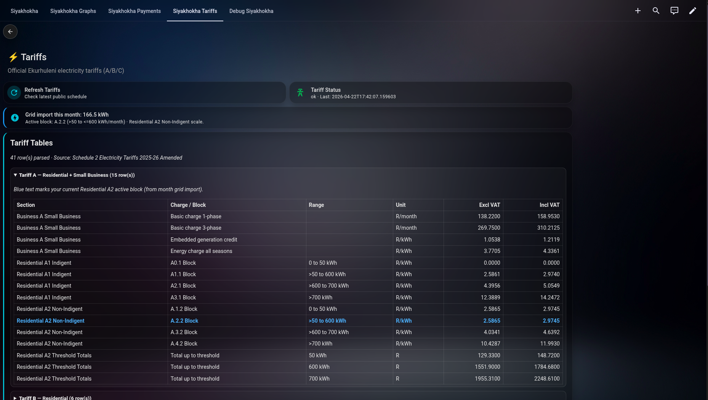
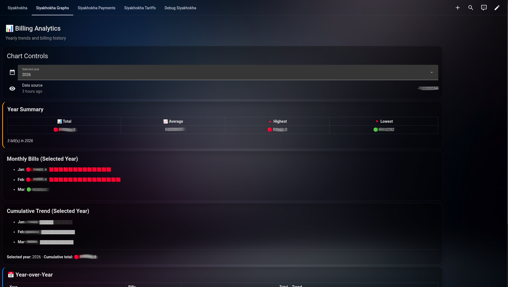
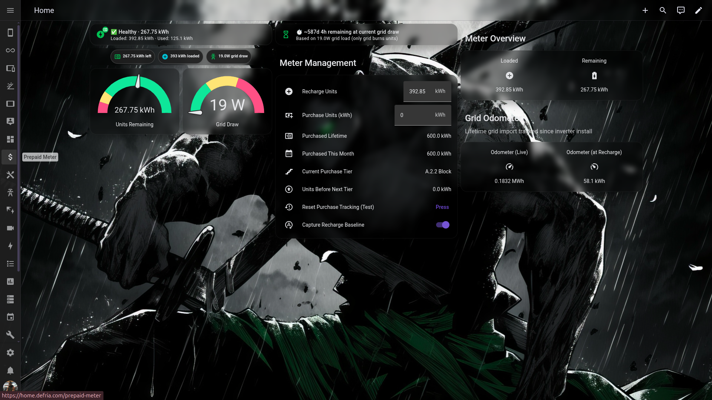

# Siyakhokha Dashboard Guide (Full Replication)

This guide mirrors the Home Assistant setup used in this project so you can replicate it end-to-end.

## Screenshot Walkthrough

Screenshots are included in `examples/screenshots/`:

<table>
  <tr>
    <td></td>
    <td></td>
  </tr>
  <tr>
    <td></td>
    <td></td>
  </tr>
  <tr>
    <td></td>
    <td></td>
  </tr>
</table>

## Files Included

Dashboards:

- `examples/siyakhokha-dashboard.yaml` (integration-focused dashboard)
- `examples/siyakhokha-dashboard-full.yaml` (full working dashboard used in development)
- `examples/siyakhokha-dashboard-public-sample.yaml` (public-facing sample)
- `examples/prepaid-meter.yaml` (prepaid meter dashboard)

Configuration snippets:

- `examples/configuration-snippets.yaml`

Automation snippets:

- `examples/automations/prepaid-purchase-track.yaml`
- `examples/automations/prepaid-purchase-reset-all.yaml`
- `examples/automations/siyakhokha-submit-batch-payment.yaml`
- `examples/automations/siyakhokha-submit-single-debit-order.yaml`
- `examples/automations/siyakhokha-single-debit-options-sync.yaml`
- `examples/automations/siyakhokha-bill-year-sync.yaml`

## Dashboard Dependencies

Install these from HACS (Frontend):

- [Mushroom Cards](https://github.com/piitaya/lovelace-mushroom)
- [Bubble Card](https://github.com/Clooos/Bubble-Card)
- [card-mod](https://github.com/thomasloven/lovelace-card-mod)

## Replication Steps

1. Install and configure the `siyakhokha_bridge` integration.
2. Merge helper entities from `examples/configuration-snippets.yaml` into your `configuration.yaml`.
3. Reload Helpers/Templates (or restart Home Assistant).
4. Create automations in the HA UI (YAML mode) using files in `examples/automations/`.
5. Import one of the dashboard YAML files from `examples/`.
6. Set `input_text.siyakhokha_entry_id` to your integration entry id.
7. Keep `input_boolean.siyakhokha_single_dry_run` set to `on` while testing payment/debit flows.

## Payment / Debit Starter Snippets

### Batch payment service call

```yaml
action: siyakhokha_bridge.submit_batch_payment
data:
  entry_id: "<your_entry_id>"
  account_numbers:
    - "<municipal_account_number>"
  amounts:
    - 250.00
  confirm: true
```

### Single debit order (simple) service call

```yaml
action: siyakhokha_bridge.submit_single_debit_order_simple
data:
  entry_id: "<your_entry_id>"
  amount: 250.00
  confirm: true
  dry_run: true
```

## Special Thanks and Credit

Special thanks to **Heinz Meulke** ([tomatensaus](https://github.com/tomatensaus)) for his excellent work:

- [DeyeSolarDesktop](https://github.com/tomatensaus/DeyeSolarDesktop)

The prepaid meter/tracker approach in this setup was inspired by:

- [Prepaid_electricity_meter.md](https://github.com/tomatensaus/DeyeSolarDesktop/blob/main/Prepaid_electricity_meter.md)

Credit where it is due.

## Disclaimer

This is a hobby project built for learning, automation, and enthusiasm for Home Assistant.

For official account management and authoritative data, always use the City of Ekurhuleni official portal:

- https://siyakhokha.ekurhuleni.gov.za/

Use this integration and all example dashboards/automations at your own discretion and risk.
By using this project, you accept full responsibility for validating actions and submitted values,
especially for payment- and debit-related operations.
